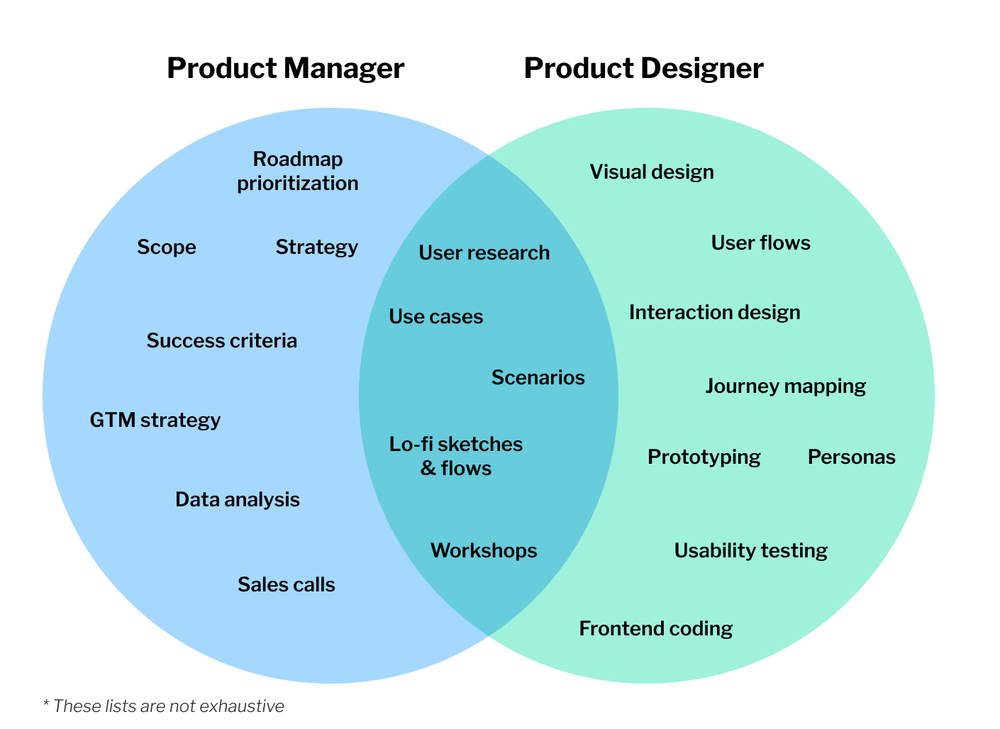

# 0x02 - Tech Roles Overview

In this lesson, you will explore an overview of product manager, designer and engineering roles in tech. 

By the end of this lesson you will:

* learn about Product Managers, Designer and Engineers.
* create a [User Story](./../../roles/product-manager.html#user-stories) for a new feature.
* create a [Wireframe](./../../roles/designer.html#wireframes) for a [User Story](./../../roles/product-manager.html#user-stories).

Let's meet Diana, Elena and Paola.

Paola is a Product Manager at SparkleHub who is great at interacting with
customers, prioritizing what work needs to be done and connecting people with
each other so that they can work together to ship great products and features.

[Learn more about Paola and her work.](./../../roles/product-manager.html)

Paola loves to write great user stories to start conversations about new
features that she would like to add to SparkleHub.

[Learn more about User Stories](./../../roles/product-manager.html#user-stories)

As a Designer, Diana gets to think creatively to come up with new ideas for how
to improve user experience on websites. This might include improving page navigation,
choosing colours palettes that are friendly to people who are
visually impaired or find better ways to present data to make it easier to
understand. Diana loves to share [wireframes](./../../roles/designer.html#what-is-a-wireframe)
with her colleagues to collect feedback.

[Learn more about Diana and her work.](./../../roles/designer.html)

As the Venn Diagram illustrates, there is some overlap with the responsibilities
between Paola and Diana.

Elena is a builder and loves to find pragmatic solutions to difficult problems.
As an Engineer, Elena is constantly challenged with new problems and learning
new things. Elena loves to code but she also likes to crunch numbers to make
sure that systems are performing efficiently so that the product can run
quickly. Elena can take new feature requests and break them down into smaller
pieces of work to help prioritize what order to build things and to raise any
technical concerns related to new feature requests.

[Learn more about Elena and her work.](./../../roles/software-engineer.html)

## Conclusion

In this lesson, you learned about how developers turn a thought or idea into a product. You were introduced to different roles in tech. You learned an overview of what a Product Manager and Designer does. You came up with your own feature idea for SparkleHub, and got to test out being a Product Manager and Designer, by coming up with a definition and wireframe. 
